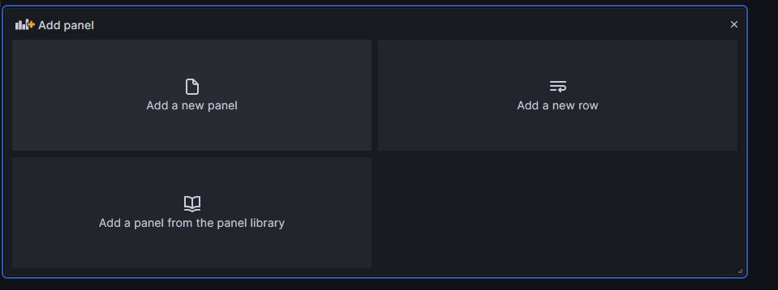

Line Simplification Algorithm DashBoard
==================================

This folder contains the various queries that can be implemented on grafana

How to use
-------------

First of all you need to install Grafana in order to have access to the Dashboard

## Create DashBoard

* Run Grafana Service

         sudo service grafana-server start
* Navigate into the grafana local server

         localhost:3000
* Set a new password (The default one is admin/admin)
* Add PostgreSQL DataSource

  
  
* Create a new DashBoard

  

## Add Panel from sql request

In order to use the request in this folder for the dashboard you need to :

* Add a New Panel

  
* Select your PostgreSQL data source
* Switch from builder to code

  
* Put Inside the code from sql file
* Check comment in sql file to know which type of panel